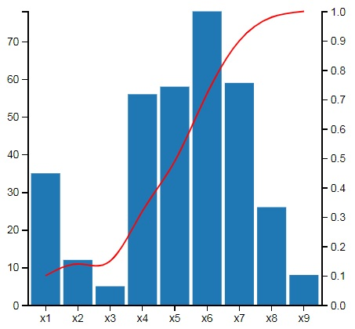

# Pareto Bar Chart (using d3js)

 

## Author

**Kirill Kupriyanov**

## Starting

* Install [Tomcat 8](https://tomcat.apache.org/download-80.cgi)

* Copy project folder into tomcat's webapps folder (for example c:\Tomcat\webapps\)

* Run tomcat server

* Main page http://127.0.0.1:8080/ParetoBarChart/

## Configuring 3D bar chart

* Data files are located in ./data

* The configuration of each chart is set in file ./script/addTwoBarCharts.js and has the form of a json string:
```
example
{
    x: 0,
    y: 0,
    width: 400,
    height: 400,
    barColor: '#1f77b4',
    lineColor: 'red',
    margin: {top: 50, right: 50, bottom: 50, left: 50},
    barPadding: 0.1
}
```
x - chart position on the axis X,
y - chart position on the axis Y,
margin - margins from the edges of the div container.

* If you only want to see one chart or add more, edit the files index.html and ./script/addTwoBarCharts.js